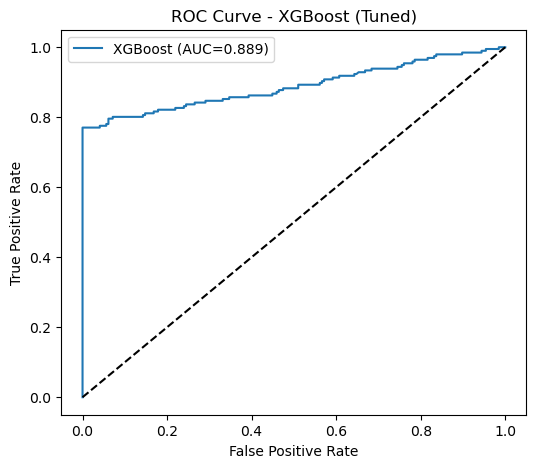
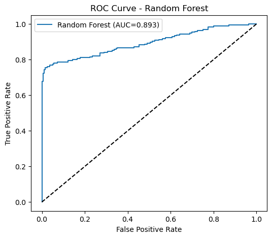
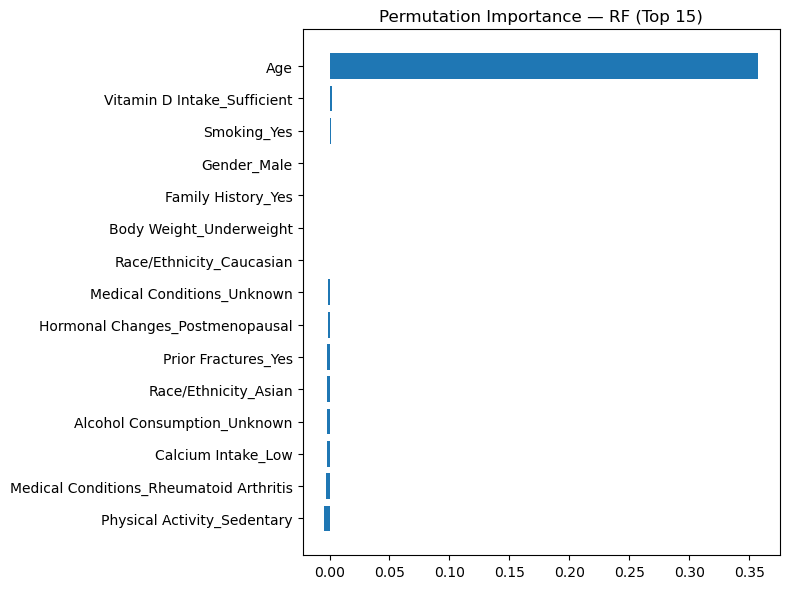
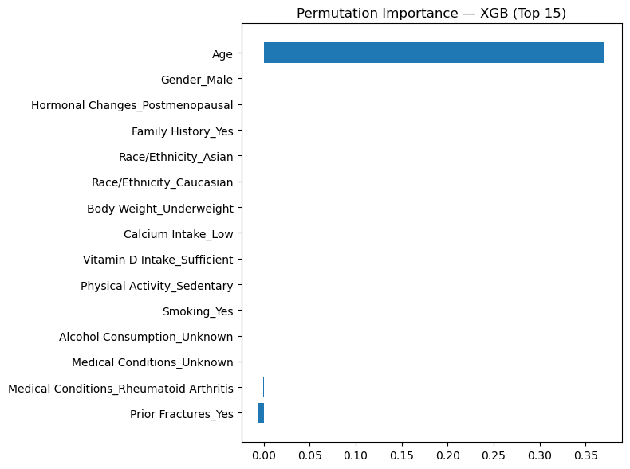
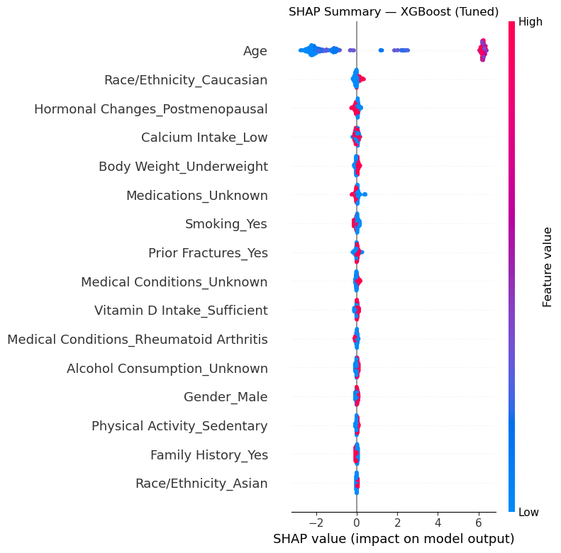

# 🩺 Osteoporosis Diagnosis Prediction

This project aims to predict **osteoporosis diagnosis** using various patient demographic, lifestyle, and medical history features.  
The goal is to build a **machine learning pipeline** that processes data, handles missing values, performs feature encoding, trains multiple models, tunes hyperparameters, and interprets results using feature importance and SHAP analysis.

---

## 📂 Project Structure
```
osteoporosis-diagnosis/
│── data/                      # Dataset folder (not uploaded to GitHub)
│── images/                    # Saved plots and visualizations
│── notebooks/                 # Jupyter notebooks for step-by-step analysis
│── osteoporosis.csv           # Dataset file (local)
│── README.md                  # Project documentation
│── requirements.txt           # Python dependencies
```

---

## 📊 Dataset
- **Name:** Osteoporosis Dataset  
- **Source:** [Kaggle - Osteoporosis Risk Prediction](https://www.kaggle.com)  
- **Size:** 1958 records, 16 features  
- **Target:** `Osteoporosis` (0 = No, 1 = Yes)  

**Key Features:**
- Demographics: Age, Gender, Race/Ethnicity  
- Lifestyle: Smoking, Alcohol Consumption, Physical Activity  
- Medical: Hormonal Changes, Family History, Medications, Prior Fractures  
- Nutritional: Calcium Intake, Vitamin D Intake  

---

## 🛠 Installation
Clone the repository and install dependencies:
```bash
git clone https://github.com/<your-username>/osteoporosis-diagnosis.git
cd osteoporosis-diagnosis
pip install -r requirements.txt
```

---

## 🔍 Methodology
1. **Data Exploration (EDA)** – Missing values, class balance, feature distributions.  
2. **Data Preprocessing** – Handling missing values, encoding categorical features.  
3. **Model Training** – Logistic Regression, Random Forest, XGBoost.  
4. **Hyperparameter Tuning** – RandomizedSearchCV for optimal parameters.  
5. **Model Evaluation** – Accuracy, Precision, Recall, F1-Score, ROC-AUC.  
6. **Model Interpretation** – Permutation Importance, SHAP values.  

---

## 📈 Results

### Model Performance (Before Tuning)
| Model               | Accuracy | Precision | Recall | F1-Score | ROC-AUC |
|---------------------|----------|-----------|--------|----------|---------|
| Logistic Regression | 0.8087   | 0.8580    | 0.7398 | 0.7945   | 0.8087  |
| Random Forest       | 0.8291   | 0.9448    | 0.6990 | 0.8035   | 0.8291  |
| XGBoost             | 0.8622   | 0.9226    | 0.7908 | 0.8516   | 0.8622  |

### Model Performance (After Tuning)
| Model         | Accuracy | Precision | Recall | F1-Score | ROC-AUC |
|---------------|----------|-----------|--------|----------|---------|
| Random Forest | 0.8648   | 0.9673    | 0.7551 | 0.8481   | 0.8932  |
| XGBoost       | 0.8750   | 0.9742    | 0.7704 | 0.8604   | 0.8886  |

---

## 📊 Visualizations

### ROC Curves (Tuned Models)
  
  

### Feature Importances  
**Random Forest (Permutation Importance)**  
  

**XGBoost (Permutation Importance)**  
  

**SHAP Summary**  
  

---

## 📌 Key Insights
- **Age**, **Prior Fractures**, and **Body Weight** were the top predictors of osteoporosis.  
- XGBoost slightly outperformed Random Forest after tuning, but both models achieved high ROC-AUC scores (>0.88).  
- SHAP analysis revealed non-linear relationships between Age and risk probability.  

---

## 🚀 Future Work
- Test on external datasets to assess generalization.  
- Explore deep learning models if larger datasets are available.  
- Deploy model as a web app for clinical use.  

---

## 📜 License
This project is licensed under the MIT License.  

---

## 👤 Author
**Yunus Emre Arslan**
